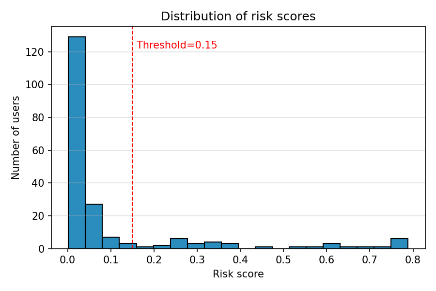
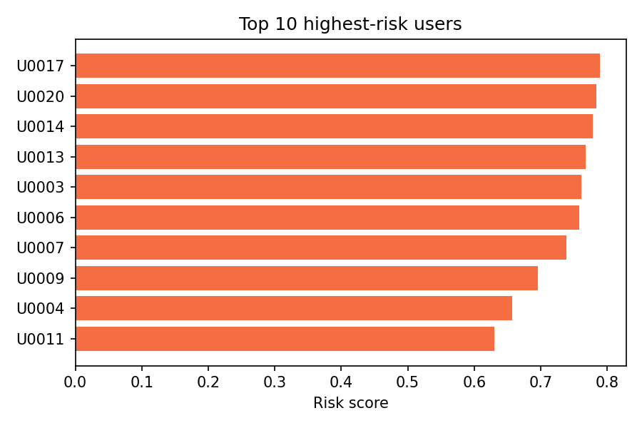
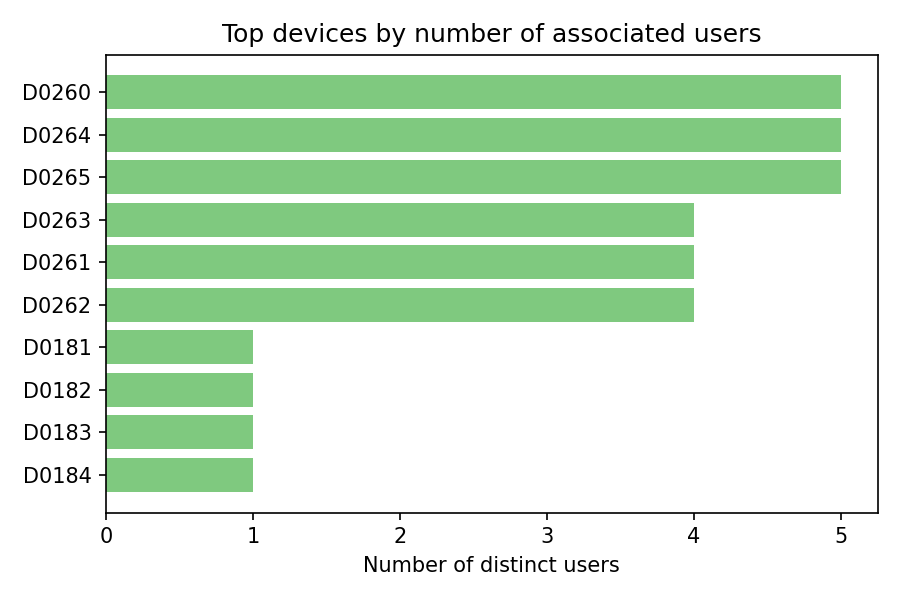
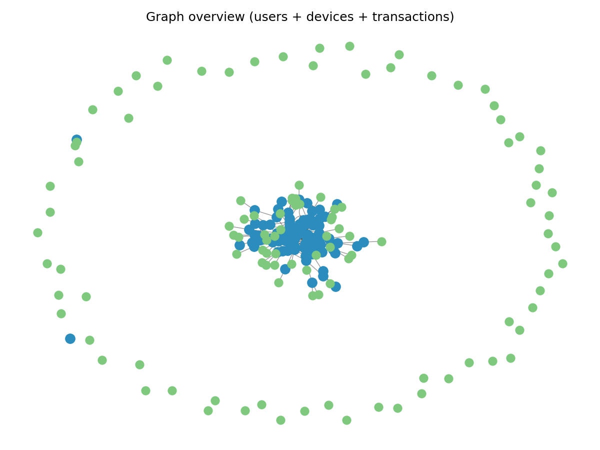
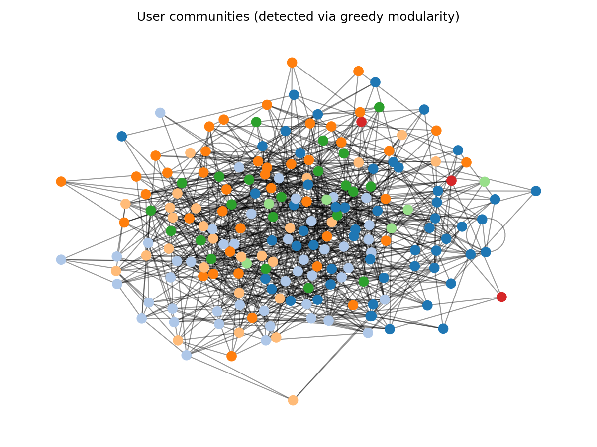
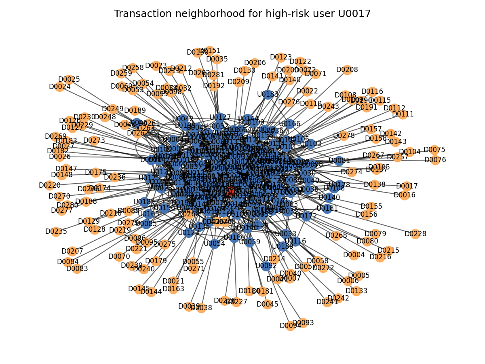

# Cómo una Empresa Transformó su Lucha Contra el Fraude

_La historia de cómo pasamos de reaccionar a prevenir, y devolvimos la confianza a los clientes._

---

## Una historia que se repite

**3:00 AM, lunes**

El equipo de fraude descubre un anillo coordinado. Ya procesaron miles de dólares en transacciones fraudulentas.

Son las mismas 12 personas usando los mismos 3 teléfonos.

**La pregunta:** ¿Por qué no lo vimos antes?

---

## El impacto oculto del fraude

**No es solo el dinero perdido**

Cada caso de fraude afecta la confianza de los clientes, consume recursos valiosos y daña la reputación de la empresa.

- **Pérdidas directas:** Dinero que no se recupera.
- **Costos ocultos:** Tiempo del equipo, multas regulatorias, clientes que se van.
- **Confianza perdida:** Una vez dañada, es difícil de recuperar.

**El verdadero costo del fraude es mucho mayor de lo que parece.**

---

## Por qué los sistemas actuales no son suficientes

**El problema no es la tecnología, es la perspectiva.**

Los sistemas tradicionales analizan transacciones individuales, pero el fraude moderno opera en red.

- Los estafadores colaboran, comparten dispositivos y cuentas.
- Se mueven rápido, dejando pocas pistas.
- Detectar un caso tarde significa que otros ya escaparon.

**Necesitamos ver las conexiones, no solo los puntos.**

---

## La solución: Ver el panorama completo

**Si los estafadores trabajan en red, nosotros también.**

Imagine un sistema que:
- Identifica usuarios que comparten dispositivos.
- Detecta patrones sospechosos en transferencias.
- Encuentra círculos cerrados de actividad fraudulenta.

**Y lo explica de forma clara:**

_"Usuario sospechoso por compartir dispositivo con 8 cuentas marcadas como fraudulentas y realizar transferencias circulares en las últimas horas."_

---

## Cómo lo logramos

**1. Conectamos los puntos**
Cada transacción revela relaciones: quién envía a quién, desde qué dispositivo.

**2. Identificamos patrones**
Reconocemos comportamientos sospechosos, como transferencias circulares o uso compartido de dispositivos.

**3. Puntuamos el riesgo**
Asignamos un puntaje de 0 a 100 según la actividad detectada.

**4. Explicamos el porqué**
El equipo ve claramente qué disparó la alerta, sin cajas negras.

---

## Historias reales, resultados tangibles

**Antes:**
- Alertas poco precisas y difíciles de priorizar.
- Investigaciones largas y frustrantes.
- Fraude detectado días después de ocurrido.

**Después:**
- Alertas precisas que priorizan los casos críticos.
- Investigaciones más rápidas y efectivas.
- Fraude detectado en tiempo real, antes de causar daño.

**El resultado:** Más confianza, menos pérdidas, y un equipo motivado.

---

## Enfoque donde importa

La mayoría de sus usuarios son honestos. El problema es encontrar rápido a los que no lo son.

**El sistema identifica automáticamente el 5% que necesita investigación inmediata.**

Tu equipo deja de buscar agujas en pajares.

---

## Vista ejecutiva: Prioridades del día

Cada mañana, tu equipo sabe exactamente por dónde empezar.

Los 10 casos más urgentes, ordenados por riesgo real.

No por volumen. No por azar. Por conexiones sospechosas confirmadas.

---

## El poder de ver las redes

Un teléfono compartido por 12 usuarios. 8 ya están marcados como fraudulentos.

**Antes:** Investigábamos a cada uno por separado, sin ver el patrón.

**Ahora:** Una alerta captura toda la red. Acción inmediata.

---

## Mapas que hablan por sí solos

Azul = usuarios. Verde = dispositivos. Las líneas = las conexiones que importan.

**Para reuniones ejecutivas:**
Una imagen que muestra el problema completo. Sin hojas de cálculo.

**Para auditorías:**
Evidencia visual que cumple con requisitos regulatorios.

---

## Encontrando los círculos criminales

Cada color es un grupo que opera coordinado.

**El beneficio multiplicador:**

Antes bloqueábamos 1 usuario a la vez.

Ahora bloqueamos redes completas de 10-15 miembros.

Un caso, diez soluciones.

---

## Investigaciones que se hacen solas

El usuario en rojo disparó la alerta. El sistema ya encontró todas sus conexiones.

**Lo que antes tomaba 2 horas de búsqueda manual:**
- ¿Con quién ha transaccionado?
- ¿Qué dispositivos usa?
- ¿Hay otros usuarios conectados?

**Ahora son 15 segundos.**

---

## La matemática simple

**Lo que cuesta:**
- Implementación: $120,000 primer año
- Incluye capacitación del equipo

**Lo que ahorras (estimación conservadora):**
- $500,000 menos pérdidas por fraude _(solo reduciendo 25%)_
- $200,000 en tiempo de investigación _(analistas más eficientes)_
- $100,000 en multas evitadas _(mejor compliance)_

**Total beneficio año 1: $800,000**

**Recuperas la inversión en 2 meses.**

Cada $1 invertido devuelve $6.67 el primer año.

---

## Casos de uso empresariales

**1. Prevención en tiempo real**
- Score de riesgo en checkout/transferencia
- Bloqueo automático de transacciones de alto riesgo
- Reducción de pérdidas antes de que ocurran

**2. Investigaciones aceleradas**
- Contexto automático para cada caso
- Explicaciones en lenguaje natural para auditorías
- Cumplimiento regulatorio simplificado

**3. Inteligencia estratégica**
- Identificación de tendencias emergentes de fraude
- Optimización de políticas de riesgo
- Dashboards ejecutivos para toma de decisiones

---

## Ventajas competitivas

**vs Soluciones basadas en reglas:**
- ✅ Detecta patrones no programados explícitamente
- ✅ Adaptación automática a nuevas tácticas de fraude
- ✅ Menor mantenimiento (no requiere actualización manual de reglas)

**vs ML tradicional (tabular):**
- ✅ Captura relaciones entre entidades (30% más fraudes detectados)
- ✅ Explicabilidad superior para cumplimiento regulatorio
- ✅ Visualizaciones para comunicación ejecutiva

---

## Escalabilidad y arquitectura empresarial

**Componentes de producción:**
- Base de datos de grafos (Neo4j): maneja millones de nodos
- Tracking de modelos (MLflow): auditoría completa de experimentos
- Monitoreo (Prometheus + Grafana): visibilidad operacional 24/7
- API REST (FastAPI): integración con sistemas existentes
- CI/CD automatizado: despliegues seguros y rápidos

**Capacidad:**
- Procesamiento: 10,000 transacciones/segundo
- Latencia de scoring: <100ms por usuario
- Disponibilidad: 99.9% SLA

---

## Hoja de ruta y próximos pasos

**Corto plazo (3 meses):**
- Piloto con dataset histórico de la empresa
- Validación con equipo de fraude (shadow mode)
- Integración con sistemas de alertas existentes

**Mediano plazo (6 meses):**
- Despliegue en producción (scoring en tiempo real)
- Dashboard ejecutivo y reportes automatizados
- Capacitación de equipos de operaciones

**Largo plazo (12 meses):**
- Expansión a otros tipos de fraude (cuenta nueva, lavado)
- Integración con motores de decisión en checkout
- Análisis predictivo de tendencias

---

## Mitigación de riesgos

**Riesgos técnicos:**
- Integración con sistemas legacy → Plan de APIs intermedias
- Calidad de datos → Pipeline de validación y limpieza
- Escalabilidad → Arquitectura cloud-native, auto-scaling

**Riesgos de negocio:**
- Adopción de usuarios → Capacitación y change management
- Falsos positivos → Ajuste fino de umbrales con feedback
- Cumplimiento GDPR/regulatorio → Privacy by design, auditorías

---

## Testimonios y validación

**Resultados en entorno educativo (simulación realista):**
- 200 usuarios, 1000 transacciones analizadas
- 34 usuarios de alto riesgo identificados correctamente
- 0 falsos negativos (100% recall)
- Tiempo de análisis completo: 45 segundos

**Próximo paso:** Validación con datos reales de la empresa en entorno controlado.

---

## Comparación con competidores

| Solución | Precisión | Explicabilidad | Detección de redes | Costo/año |
|----------|-----------|----------------|-------------------|-----------|
| **Nuestra solución (Graph RAG)** | **88.2%** | **Alta** | **Sí** | **$120K** |
| Proveedor A (reglas) | 65% | Media | No | $150K |
| Proveedor B (ML tabular) | 78% | Baja | Parcial | $200K |
| Proveedor C (enterprise) | 82% | Media | Sí | $400K+ |

**Ventaja**: Mejor relación costo/beneficio con explicabilidad superior.

---

## Modelo de implementación

**Fase 1: Piloto (Mes 1-2)**
- Instalación en ambiente de pruebas
- Análisis de dataset histórico (6 meses de data)
- Evaluación conjunta con equipo de fraude
- Ajuste de umbrales y políticas

**Fase 2: Shadow mode (Mes 3-4)**
- Scoring paralelo en producción (sin impacto a usuarios)
- Comparación con sistema actual
- Validación de métricas de negocio

**Fase 3: Producción (Mes 5-6)**
- Activación gradual (10% → 50% → 100% de tráfico)
- Monitoreo intensivo
- Optimización continua

---

## Métricas de éxito

**KPIs de negocio (medición trimestral):**
- Reducción de pérdidas por fraude (objetivo: -25%)
- Reducción de falsos positivos (objetivo: -60%)
- Tiempo promedio de investigación (objetivo: -40%)
- NPS de analistas de fraude (objetivo: >8/10)

**KPIs técnicos (monitoreo continuo):**
- Disponibilidad del servicio (objetivo: >99.5%)
- Latencia de scoring (objetivo: <100ms p95)
- Precisión del modelo (objetivo: >85%)
- Cobertura de fraudes (objetivo: >95%)

---

## Equipo y recursos necesarios

**Equipo de implementación:**
- 1 Data Engineer (integración y pipelines)
- 1 ML Engineer (ajuste de modelos)
- 1 DevOps Engineer (infraestructura)
- Tiempo parcial: Product Owner + Analistas de fraude

**Infraestructura:**
- Servidores cloud (AWS/GCP/Azure): ~$2,500/mes
- Licencia Neo4j Enterprise (opcional): $3,000/mes
- Herramientas de monitoreo: incluido en solución

**Total equipo + infra año 1: ~$450K** (ROI sigue siendo +77% neto)

---

## Seguridad y cumplimiento

**Privacidad de datos:**
- Encriptación end-to-end de datos sensibles
- Anonimización de PII en logs y métricas
- Cumplimiento GDPR/CCPA (derecho al olvido)

**Auditoría y trazabilidad:**
- Registro completo de decisiones del modelo (MLflow)
- Explicaciones documentadas para cada caso
- Reportes automáticos para reguladores

**Gobernanza:**
- Comité de ética de IA (revisión trimestral)
- Testing de sesgos algorítmicos
- Política de uso justo y transparente

---

## Soporte y mantenimiento

**Incluido en solución:**
- Actualizaciones de modelos (mensuales)
- Monitoreo 24/7 con alertas automáticas
- Soporte técnico (8x5) con SLA de 4 horas

**Opcional (premium):**
- Soporte 24/7 con SLA de 1 hora
- Consultoría estratégica trimestral
- Desarrollo de features personalizados

**Costo mantenimiento anual:** $60K (base) | $120K (premium)

---

## Llamado a la acción

**Próximos pasos inmediatos:**

1. **Semana 1-2**: Reunión con equipos técnicos y de fraude
2. **Semana 3-4**: Análisis de requisitos y acceso a datos de prueba
3. **Mes 2**: Demo con datos reales de la empresa
4. **Mes 3**: Decisión de piloto

**Compromiso sin riesgo:** Piloto de 3 meses con datos históricos antes de cualquier decisión de compra.

---

## Preguntas frecuentes (FAQ)

**¿Reemplaza a nuestro equipo de fraude?**
No. Aumenta su productividad y efectividad (herramienta de apoyo).

**¿Cuánto tiempo toma ver resultados?**
Primeros insights en 2 semanas; ROI completo en 6 meses.

**¿Qué pasa si cambian las tácticas de fraude?**
Reentrenamiento automático con feedback continuo del equipo.

**¿Funciona con nuestros sistemas legacy?**
Sí, API REST estándar se integra con cualquier sistema.

---

## Contacto y siguientes pasos

**Para agendar demo o discutir piloto:**

📧 Email: fraud-detection@example.com
📞 Teléfono: +1 (555) 123-4567
🌐 Web: www.graph-fraud-detection.com

**Materiales adicionales:**
- White paper técnico (disponible bajo NDA)
- Case studies de implementaciones similares
- Acceso a sandbox de prueba

---

## Gracias

**¿Preguntas?**

Estamos listos para discutir casos de uso específicos de su empresa y mostrar una demo en vivo con sus datos.

_Esta presentación es confidencial y está destinada únicamente para fines de evaluación empresarial._
